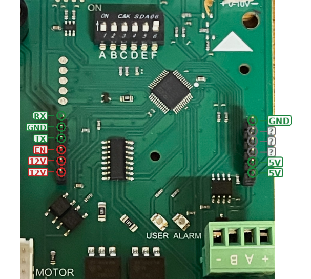

# ESPHome Innova OSMO

Local Home Assistant control for **Innova OSMO** fancoils — no Innova cloud, no
extra Modbus accessories. A Wemos/Lolin D1 mini (ESP8266) replaces the original
`INNOVA-WIFI-V0_3` module and talks Modbus RTU directly to the fancoil mainboard
over its TTL UART.

> Verified on Innova OSMO with mainboard `ESE845II` (silkscreen `INNOVA-M7-V0_3`)
> and on-board control `EWA844II`.

## ⚠️ Read this first — two ways to damage your board

1. **The mainboard UART lives in a 5 V domain** (its TX line idles at ~5 V with
   the WiFi module removed). Never wire the data lines straight to an ESP8266:
   use a bidirectional level shifter (a 4-channel BSS138 breakout costs cents).
2. **The `EN` pin on the left module header sits right next to the two 12 V pins**
   (5th and 6th pin). Accidentally bridging `EN` to 12 V — a slipped probe tip is
   enough — **instantly destroys the proprietary controller chip** that runs the
   whole mainboard. That chip cannot be bought as a spare: the only fix is
   transplanting it from a donor board (see
   [docs/repair-notes.md](docs/repair-notes.md)). Measure with the power off
   whenever possible, and stay away from `EN`: it is not needed for this project.

## Why

The OSMO's stock WiFi module only talks to the Innova cloud (and commands
occasionally get lost along the way — we watched it happen on the bus). The
existing ESPHome components for Innova fancoils
([pico1881/Esphome-Innova-Climate](https://github.com/pico1881/Esphome-Innova-Climate),
[jjdejong/esphome-airleaf](https://github.com/jjdejong/esphome-airleaf)) target
the **AirLeaf** RS485 interface and its register map, which the OSMO does not use.

This project reverse-engineered the OSMO's own protocol by passively sniffing
the serial link between the mainboard and the WiFi module. Full write-up in
[docs/protocol.md](docs/protocol.md).

## The protocol (TL;DR)

The link between mainboard (slave, address 1) and WiFi module (master) is
**Modbus RTU, 9600 8N1**, on a 5 V TTL UART.

| Register | Meaning | Access | Values |
|----------|---------|--------|--------|
| 0 | Room temperature ×10 | RO | e.g. 259 = 25.9 °C |
| 151 | Status/alarms bitfield | RO | bit9 = water temperature out of range |
| 305 | Setpoint ×10 | R/W | 255 = sentinel written by cloud while OFF |
| 553 | Program bitfield | R/W | bits 0-2: fan 0=auto 1=night 2=max; bit4 = standby |
| 556 | Season | R/W | 0=auto, 1=heating, 2=cooling |

## Hardware

- Wemos/Lolin D1 mini (ESP8266).
- **Bidirectional level shifter module, 4-channel BSS138 type** (the ones sold
  as "I2C logic level converter 3.3V/5V" — the I2C in the name is just
  marketing, they shift any logic signal; 9600 baud UART is trivial for them).
- 1 resistor **1 kΩ** (boot pull-down for GPIO15, see below).
- Power: the module header exposes a 5 V pin that comfortably powers the D1 mini.

### Pin choice on the D1 mini (important)

Do **not** use the default UART pins GPIO1/GPIO3 (`TX`/`RX`): on most D1 mini
clones the on-board USB-serial chip loads the RX line (the series resistor is
missing) and external devices cannot drive it. This project uses **UART0 in
hardware swap mode**: **GPIO15 = TX (pin D8), GPIO13 = RX (pin D7)** — still a
full hardware UART, no CH340 interference, and the ESP8266 boot-ROM chatter at
74880 baud never reaches the fancoil (it only goes out on GPIO1).

GPIO15 is a boot-strap pin and must be low at power-up; the shifter channel's
pull-up would float it high. The **1 kΩ resistor from D8 to GND** fixes that.

### Wiring

Where the pins sit on the mainboard (photo taken with the WiFi module removed):

Left header, top to bottom: **RX, GND, TX, EN, 12V, 12V**. Right header, top to
bottom: **GND**, three unidentified pins, **5V, 5V**. Green = the pins this
project uses (5V, GND, TX, RX); red = stay away (`EN` sits right next to the
12 V pins — see the warning at the top); grey = purpose unknown.

The silkscreen labels are from the **module's** perspective (its `RX` pin
receives from the mainboard's TX). The D1 mini takes the module's place, so
ESP RX goes to the pin labelled `RX` and ESP TX to the pin labelled `TX` —
no crossover. Pin by pin, left header in the photo, top to bottom:

| Pin (top→bottom) | Silkscreen | Idle level (module removed) | Role | Connect to (through shifter) |
|---|---|---|---|---|
| 1 | `RX` | **~5 V** | Mainboard TX → data out | **D7** (GPIO13, ESP RX) |
| 2 | `GND` | — | Ground | GND |
| 3 | `TX` | low (~1.5 V) | Mainboard RX ← data in | **D8** (GPIO15, ESP TX) + 1 kΩ to GND |
| 4 | `EN` | — | **Do not touch** (see warning) | — |
| 5–6 | `12V` | 12 V | Not used | — |

Right header: the two bottom `5V` pins power the D1 mini (and the shifter HV
side), `GND` on top. Sanity check before wiring: the pin labelled `RX` (1st
from top) is the only data pin that idles at ~5 V.

Everything goes through the level shifter:

| Mainboard header | Level shifter | D1 mini |
|---|---|---|
| 5V | HV | 5V (power) |
| — | LV | 3V3 |
| GND | GND | GND |
| `RX` pin (mainboard TX, idles ~5 V) | HV1 ↔ LV1 | D7 (GPIO13, ESP RX) |
| `TX` pin (mainboard RX, idles ~1.5 V) | HV2 ↔ LV2 | D8 (GPIO15, ESP TX) |

Plus the 1 kΩ from D8 to GND.

**Remove the original WiFi module first** — one master only on the bus. Keep it
in a drawer: the swap is fully reversible.

## Carrier board (coming soon)

A dedicated carrier board is in the works — not a PCB from a fab house, but a
**3D-printed one**: the board is printed in PLA with the traces as raised
ridges, self-adhesive copper tape is then laid over the ridges, and the
components are soldered directly onto the copper. A cheap, fast way to get a
rigid, reliable single-purpose board with no etching and no waiting for
shipping — well suited to a project like this where the "circuit" is really
just interconnections.

The board hosts:
- headers for the D1 mini
- the 4-channel level shifter module
- a 4-pin header for the final connection to the fancoil (5V, GND, TX, RX)
- two holes for the GPIO15 boot pull-down resistor

STL/design files will be added to this repository once finalized.

## Install

1. Copy `components/innova_osmo/` into your ESPHome config dir under `components/`.
2. Copy `example-fancoil.yaml`, adjust the `substitutions:` block and your
   WiFi/API/OTA secrets.
3. Flash, wire, done. You get a full `climate` entity (off/heat/cool/auto,
   fan auto/night/max, setpoint 16-30 °C), a room temperature sensor, a
   "water out of range" problem binary sensor, and a diagnostic raw status value.

## Reverse-engineering toolkit

`tools/capture.py` (passive UART sniffer with millisecond timestamps and
event markers) and `tools/analyze.py` (Modbus CRC sliding-window scanner +
frame decoder + non-Modbus framing characterizer) are included — they are
generic and reusable for sniffing any serial protocol. See
[docs/protocol.md](docs/protocol.md) for the method.

## Credits

- Component structure derived from [pico1881/Esphome-Innova-Climate](https://github.com/pico1881/Esphome-Innova-Climate) (AirLeaf).
- Protocol capture & analysis done with [Claude Code](https://claude.com/claude-code).
